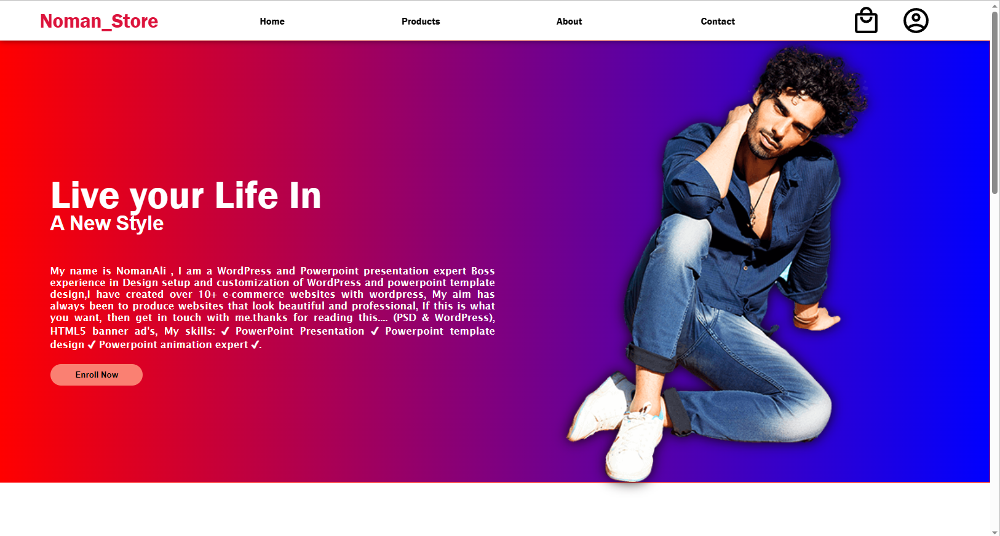

# Data Manipulation in Array using Pointers in C++

This is simple E-com Site template using Html, Css

## Authors

- [@nomankhokhar](https://www.github.com/nomankhokhar)

## Badges

## 🚀 About Me

I'm a full stack developer...
